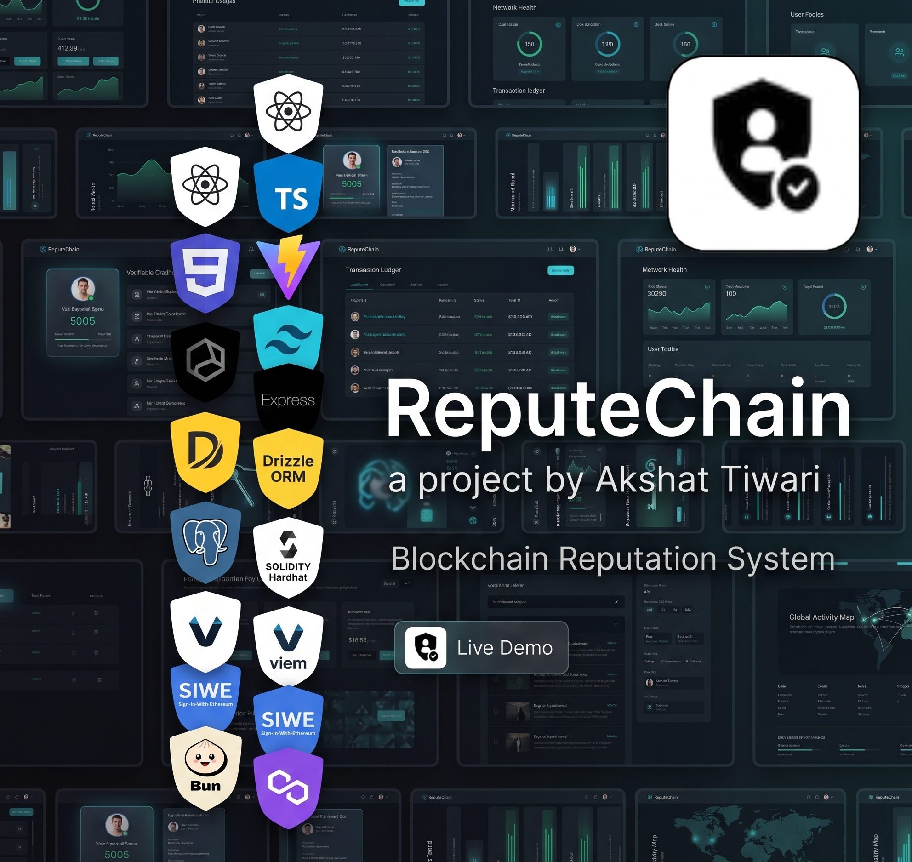
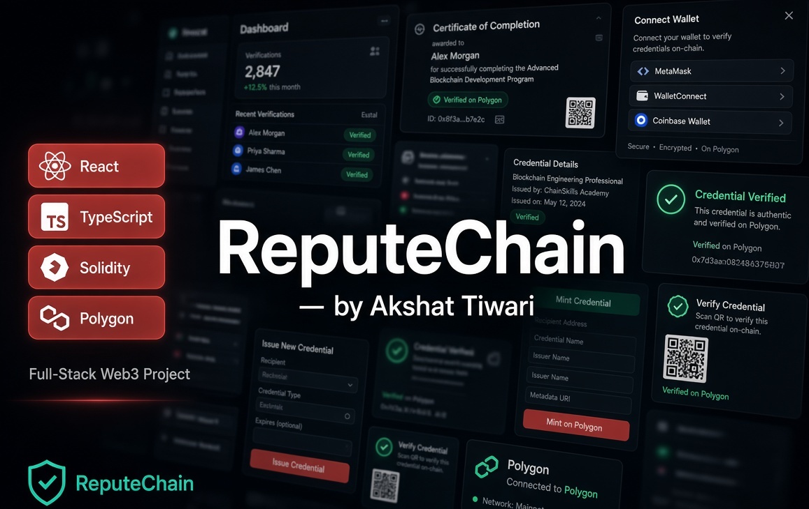
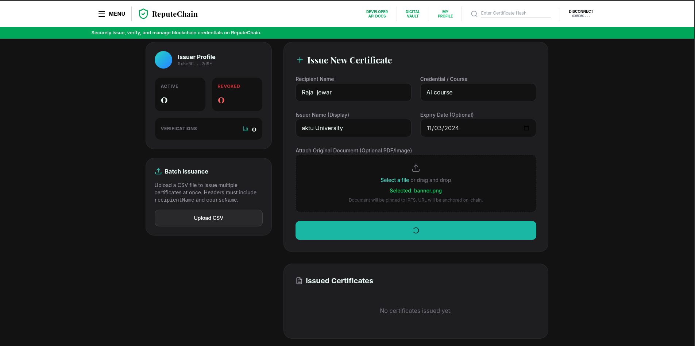
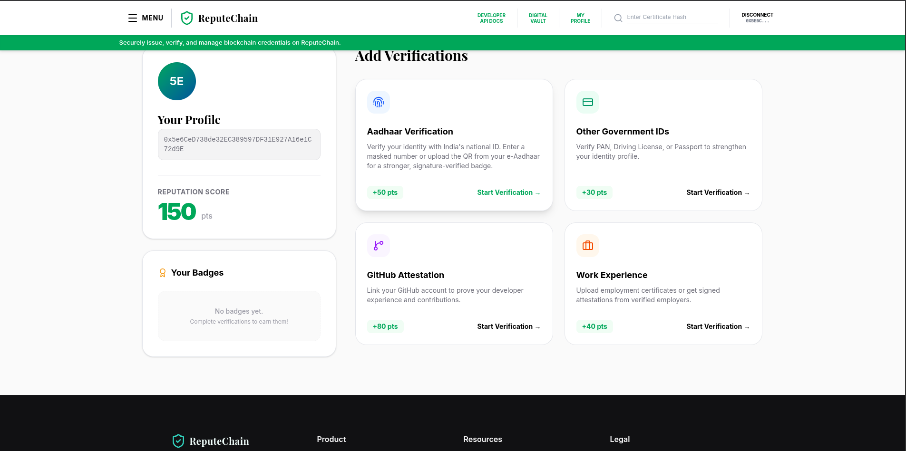
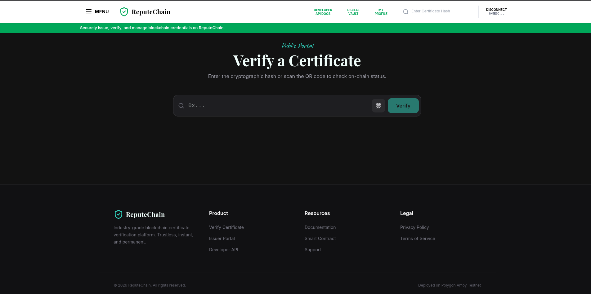

Tamper-proof credential verification, built on trust you can actually audit.
## Screenshots

<table>
  <tr>
    <td align="center"> <b>Landing — hero</b></td>
    <td align="center"> <b>Landing — flow</b></td>
  </tr>
  <tr>
    <td align="center"> <b>Issuer portal / mint</b></td>
    <td align="center"> <b>Holder document wallet</b></td>
  </tr>
  <tr>
    <td align="center"> <b>Verifier — hash / QR</b></td>
    <td align="center"> <b>Verification result</b></td>
  </tr>
  <tr>
    <td align="center"> <b>Public certificate page</b></td>
    <td align="center"> <b>Mobile views</b></td>
  </tr>
</table>
A decentralized platform for issuers, holders, and verifiers of verifiable credentials — anchored on Polygon.  
Issuers mint once. Holders own their documents. Anyone verifies cryptographically in seconds.

**Full-stack TypeScript + Web3 project** · React · Express · Drizzle · Solidity · Polygon Amoy

---

## Table of Contents

1. [Overview](#overview)
2. [Screenshots](#screenshots)
3. [Features](#features)
4. [Tech Stack](#tech-stack)
5. [Architecture at a Glance](#architecture-at-a-glance)
6. [Getting Started](#getting-started)
7. [Environment Variables](#environment-variables)
8. [Live Demo](#live-demo)
9. [Project Structure](#project-structure)
10. [Roadmap](#roadmap)
11. [License](#license)
12. [Contact](#contact)

---

## Overview

ReputeChain is a fully working end-to-end credential platform — not a UI mockup with placeholder data. Every feature is wired: real smart-contract anchoring on Polygon Amoy, real SIWE wallet authentication, real Postgres indexing via Drizzle, three distinct portals (Issuer / Holder / Verifier), QR generation & scanning, and production-minded hardening.

The core problem it solves is still painfully common: **verifying that a credential is real remains needlessly manual.** Degrees, certifications, background checks — most of it still comes down to a phone call, an emailed PDF, or blind trust in a logo.

ReputeChain flips that model:

> **Issuer signs once → Holder owns it → Anyone verifies cryptographically without contacting the issuer.**

It was built as a portfolio piece that demonstrates production-shaped decisions rather than tutorial shortcuts: on-chain hash as the source of truth, off-chain metadata for speed, server-side enforcement, clear error states, and a verifier experience that requires zero crypto knowledge.

### Highlights

- 🔗 **Real on-chain credential hashing** — every credential’s data hash is anchored on Polygon Amoy; the human-readable payload lives off-chain for fast reads
- 👥 **Three distinct user portals** — Issuer (mint & manage), Holder (document wallet), Verifier/Recruiter (instant lookup)
- 🔐 **SIWE wallet authentication** — Sign-In-With-Ethereum for issuers and holders; no extra accounts to manage
- ⚡ **Instant verification** — by hash, QR code, or public link; works for recruiters who have never opened MetaMask
- 🏷️ **Issuer minting flow** — category support (Academic, Identity, Work, GitHub, Other), optional expiry, reputation boost
- 🗂️ **Holder document wallet** — store, view, and share credentials from a personal, self-custodied interface
- 📱 **QR + public-link sharing** — generate a QR or shareable URL so a recruiter can verify without any wallet
- 🛡️ **Production hardening** — Helmet, express-rate-limit, JWT sessions, input validation, clear revoked/expired states
- 🎨 **Responsive, accessible UI** — Tailwind + Motion, keyboard-friendly, dedicated loading / empty / error states

---

## Screenshots

> Replace the placeholder paths below with real screenshots from the live app or local runs.

| Landing page hero | Issuer dashboard / mint flow |
|---|---|
|  |  |
| *Homepage with credential preview card and CTAs* | *Mint form, category selection, on-chain confirmation* |

| Holder document wallet | Verifier / certificate detail |
|---|---|
|  |  |
| *Personal credential list with share & QR actions* | *Hash / QR verification result with on-chain proof* |

| QR scan / public verification | Mobile views |
|---|---|
|  |  |
| *Camera-based QR scan and public certificate page* | *Responsive layouts across portals* |

---

## Features

### Credential Issuance
- Mint verifiable credentials tied to a recipient wallet address
- Categories: Academic, Identity, Work, GitHub, Other
- Optional expiry timestamp and reputation boost for the subject
- On-chain hash anchoring + off-chain metadata URI (IPFS-ready via Pinata)
- Only verified issuers (on-chain allowlist + optional off-chain allowlist) can issue
- Clear success / failure states and transaction feedback

### Holder Wallet & Sharing
- Personal document wallet listing all credentials issued to the connected address
- View full credential details, status (valid / expired / revoked)
- Generate QR codes and public shareable links
- No need for the holder to understand smart contracts — just connect wallet and use

### Verification & Recruiter Experience
- Verify by certificate hash, QR code, or direct public URL
- Zero-crypto path: a recruiter can open a link or scan a QR and see a clear valid / invalid result
- Displays issuer, subject, issue date, expiry, category, and on-chain proof (tx / contract data)
- Server-side and contract-level checks for revocation and expiry

### Blockchain Layer
- Solidity contract (`ReputeChain.sol`) with:
  - Verified-issuer registry
  - Certificate issuance, revocation, and view verification
  - Per-address reputation score
- Deployed and tested via Hardhat on Polygon Amoy (testnet)
- On-chain hash is the source of truth for tamper-evidence

### Authentication & Security
- SIWE (Sign-In-With-Ethereum) for wallet-based sessions
- JWT for API session handling
- Helmet + express-rate-limit
- Sensitive identifiers (e.g. Aadhaar) hashed with a dedicated salt before storage
- Issuer allowlist (on-chain + configurable off-chain)

### Reliability & Polish
- Clear revoked / expired / not-found states instead of generic errors
- Loading, empty, and error UI across all portals
- Responsive design with Motion animations
- One-command local setup with documented environment variables

---

## Tech Stack

### Frontend
- **React 19** + **TypeScript**
- **Vite 6** for build tooling
- **React Router** for multi-portal navigation (public / issuer / holder / verifier)
- **Tailwind CSS 4** + **Motion** for styling and animation
- **viem** + **ethers** + **siwe** for wallet connection and Sign-In-With-Ethereum
- **html5-qrcode** / **jsqr** / **qrcode.react** for QR generation and scanning
- **lucide-react**, **recharts**, **react-countup** for UI polish

### Backend
- **Express** + **TypeScript**
- **Drizzle ORM** + **PostgreSQL** for off-chain metadata and indexing
- **JWT** session handling
- **helmet** + **express-rate-limit** for hardening
- **multer** for uploads, **jimp** for image processing

### Blockchain
- **Solidity** (`ReputeChain.sol`)
- **Hardhat** for compilation, testing, and deployment
- **Polygon Amoy** testnet (RPC configurable)
- On-chain hash anchoring + optional IPFS metadata (Pinata)

### Tooling
- **Bun** as package manager and script runner
- **tsx** for TypeScript server execution
- **drizzle-kit** for schema management

---

## Architecture at a Glance
┌─────────────┐      mint credential       ┌──────────────────┐
│   Issuer    │ ─────────────────────────▶ │  Smart Contract   │
│   Portal    │                            │  (hash + metadata)│
└─────────────┘                            └──────────────────┘
│
▼
┌─────────────┐      holds & shares        ┌──────────────────┐
│   Holder    │ ◀───────────────────────── │  Postgres index   │
│   Wallet    │                            │  (Drizzle ORM)    │
└─────────────┘                            └──────────────────┘
│
▼
┌─────────────┐      instant lookup        ┌──────────────────┐
│  Verifier   │ ─────────────────────────▶ │   /api/verify     │
│  / Recruiter│                            │   (hash-based)    │
└─────────────┘                            └──────────────────┘
text> **Design tradeoff (intentional MVP):** credential metadata is indexed off-chain in Postgres for fast lookups and rich UI, while the credential hash itself is anchored on-chain as the source of truth for tamper-evidence. A fully on-chain read path is on the roadmap.

---

## Getting Started

**Prerequisites:** Node.js 18+, [Bun](https://bun.sh/), PostgreSQL (local or Neon/Atlas)

bash
# 1. Clone the repository
git clone https://github.com/akshattiwari-dev/Reputechain.git
cd Reputechain

# 2. Install dependencies
bun install

# 3. Configure environment
cp .env.example .env
# Fill in DATABASE_URL, JWT_SECRET, ID_HASH_SALT, RPC_URL,
# CONTRACT_ADDRESS, ISSUER_PRIVATE_KEY, and optional Pinata / allowlist values

# 4. Push the database schema
bun run drizzle-kit push

# 5. (Optional) Local Hardhat node + contract deploy
bunx hardhat node
# in another terminal:
bunx hardhat run scripts/deploy.cjs --network localhost
# then update CONTRACT_ADDRESS in .env

# 6. Start the app
bun run dev
The app serves both the Vite frontend and the Express API.

Open the URL shown in the terminal (typically http://localhost:5173 or the port configured in server.ts).
Notes

Use Polygon Amoy testnet MATIC from the official faucet for real on-chain writes.
Leave CONTRACT_ADDRESS as the placeholder only for pure UI/local demo; write paths will fall back to mock tx hashes until a real contract is set.
Never commit real private keys or production secrets.

Environment Variables
Both the backend and frontend configuration are driven from a single documented .env.example.

Copy it to .env and fill in real values. Every variable is commented inline with where to obtain it (Neon connection string, JWT secret generation, Polygon Amoy RPC, Pinata JWT, UIDAI cert path, etc.).
Do not invent a long table here — the source of truth is the committed .env.example.

Live Demo
https://reputechain-nu.vercel.app
The live deployment runs the same codebase, connected to Polygon Amoy testnet.

You can verify credentials, explore the issuer flow, and use the holder/verifier portals end-to-end without any special setup (testnet wallet recommended for full issuer actions).

Project Structure
text├── contracts/
│   └── ReputeChain.sol          # On-chain credential contract
├── drizzle/                     # Drizzle migrations / meta
├── public/                      # Static assets
├── scripts/                     # Hardhat deploy & utility scripts
├── src/
│   ├── components/              # Shared UI (Navbar, Footer, etc.)
│   ├── contexts/                # Wallet connection state
│   ├── db/                      # Drizzle schema + client
│   ├── lib/                     # Shared utilities, QR handling
│   └── pages/
│       ├── public/              # Landing, docs
│       ├── issuer/              # Issuer dashboard, mint, profile
│       ├── verifier/            # Verify, certificate view, recruiter
│       └── legal/               # Terms, privacy
├── test/                        # Contract & integration tests
├── .env.example
├── hardhat.config.cjs
├── server.ts                    # Express + Vite integration entry
├── drizzle.config.ts
└── package.json

Roadmap

 Move credential reads fully on-chain to remove the Postgres trust dependency
 Stronger rate-limiting and optional auth on the public verification endpoint
 Multi-chain support (currently single EVM chain — Polygon Amoy)
 Issuer revocation flow with clearer on-chain event surface and UI feedback
 Aadhaar-based identity verification path, brought fully into compliance with UIDAI data-handling requirements
 Richer issuer analytics and credential lifecycle management

License
This project does not currently ship a formal open-source license — it is shared as a portfolio and reference piece.
If you would like to reuse, fork, or build on it beyond personal study, reach out (see Contact) and we can sort out terms.

Contact
I'm Akshat Tiwari — a full-stack TypeScript engineer with ~3 years of experience shipping production web applications. I focus on React/Node systems and am actively deepening my Web3 skills by building things that use the chain for what it’s actually good at: making claims tamper-evident and independently verifiable.

GitHub: akshattiwari-dev
Portfolio: akshattiwari.dev
Email: feel free to reach out via the portfolio contact or GitHub

If you’re looking for collaboration on web/app development projects, or you’re hiring and like how this problem was approached, I’d be happy to connect.

Built with a lot of coffee and a stubborn refusal to trust unverifiable PDFs.
